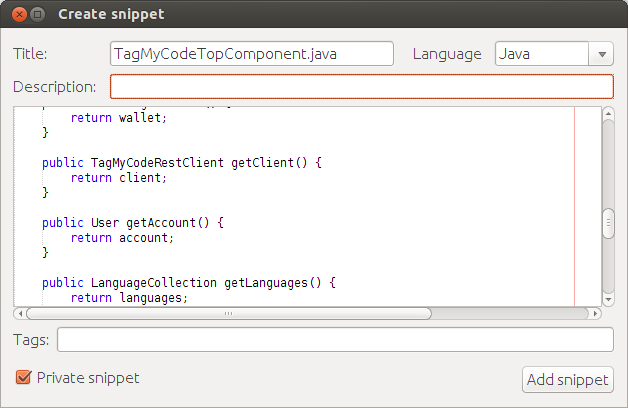

TagMyCode Official NetBeans Plugin
==================================

This is the official NetBeans plugin for TagMyCode



## Getting started

### Consumer Id and Consumer secret
You need to create a Java class ```Secret.java``` into ```com/tagmycode/netbeans```

```java
package com.tagmycode.netbeans;

import com.tagmycode.plugin.AbstractSecret;

class Secret extends AbstractSecret {

    @Override
    public String getConsumerId() {
        return "YOUR_CONSUMER_ID";
    }

    @Override
    public String getConsumerSecret() {
        return "YOUR_CONSUMER_SECRET";
    }

}

```
